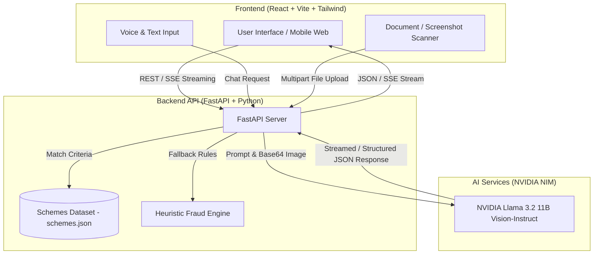

# Kisanमित्र (KisanMitr) 🌾

[](https://kishan-mitra-sigma.vercel.app/)

[](https://sih.gov.in/)
[](https://fastapi.tiangolo.com/)
[](https://react.dev/)
[](https://www.typescriptlang.org/)
[](https://build.nvidia.com/)
[](LICENSE)

> **AI-Powered Agricultural Policy, Subsidy Matching, and Fraud Protection Companion for Indian Farmers.**

👉 **🌐 Visit Live Web Application**: **[https://kishan-mitra-sigma.vercel.app/](https://kishan-mitra-sigma.vercel.app/)**

---

## 📌 Problem Statement & Solution

Millions of farmers in India miss out on government schemes, agricultural subsidies, and financial benefits due to:
1. **Complex documentation and bureaucratic jargon**
2. **Language and literacy barriers**
3. **Lack of personalized eligibility awareness**
4. **Surging agricultural scams and fee-fraud targeting rural citizens**

**Kisanमित्र (KisanMitr)** bridges this critical gap. It is a next-generation digital companion that leverages **Multimodal LLMs (NVIDIA Llama 3.2 Vision)**, **voice-first interaction**, and **real-time scheme matching** to empower every farmer to discover, understand, and claim their rightful benefits safely.

---

## 🌟 Key Features

### 1. 🎙️ Multilingual Voice & AI Chat Assistant
- **Conversational Guidance**: Speaks and understands **Hindi (Devanagari)**, **Hinglish**, and **English**.
- **Voice-First Input**: Built-in voice-to-text recognition allows farmers to ask queries naturally without typing.
- **Streaming Responses**: Server-Sent Events (SSE) deliver real-time token streaming with smooth typing indicators.
- **Agriculture Expert System**: Trained prompt context covering crop advisories, soil health, fertilizer guidelines, and central/state government schemes (including Chhattisgarh's Krishi Vibhag).

### 2. 📄 Vision-Based Smart Document Scheme Matcher
- **Multimodal AI OCR**: Farmers can upload photos/scans of **Aadhaar cards, Land Records (Bhu-naksha/Khasra), or Income Certificates**.
- **Automatic Data Extraction**: Uses **NVIDIA Llama 3.2 Vision** to extract land holdings, income tiers, and demographic categories.
- **Intelligent Scheme Matching**: Cross-references extracted farmer profile data with a database of 12+ government schemes (e.g., PM-KISAN, PMFBY, KCC, PM Krishi Sinchayee Yojana).
- **Clear Reasoning**: Explains *why* the farmer qualifies for each scheme in simple language.

### 3. 🛡️ AI Fraud Shield
- **Scam Detection**: Protects farmers from fraud (e.g., fake PM-KISAN fee demands, registration scams, OTP traps).
- **Multimodal Analysis**: Accepts both text messages (SMS/WhatsApp) and screenshots of suspicious chats/notices.
- **Risk Rating**: Returns instant risk levels (**High / Medium / Low**), key warning red flags, and safety guidelines.
- **Hybrid Guardrails**: Combines AI Vision/LLM analysis with heuristic pattern fallback.

### 4. 🌾 Scheme Directory & Eligibility Calculator
- **Central & State Coverage**: Detailed breakdown of active subsidies and support programs.
- **Filter & Search**: Easily filter schemes by land size, category (General/OBC/SC/ST), or state.
- **Step-by-step Guides**: Provides required documents, CSC center location guidance, and online registration steps.

### 5. 🌐 Seamless Bilingual Experience
- **Instant Language Toggle**: Effortlessly switch between Hindi and English across the entire interface.
- **Local Persistence**: Remembers farmer details, onboarding preferences, and language selection.

---

## 🏗️ System Architecture



---

## 🛠️ Tech Stack

### Frontend
- **Framework**: React 18 + Vite
- **Language**: TypeScript
- **Styling**: Tailwind CSS
- **Icons**: Lucide React
- **Routing**: React Router v6

### Backend
- **Framework**: FastAPI (Python 3.10+)
- **ASGI Server**: Uvicorn
- **AI Integration**: OpenAI Python SDK configured for NVIDIA NIM Endpoint (`https://integrate.api.nvidia.com/v1`)
- **AI Model**: `meta/llama-3.2-11b-vision-instruct`
- **OCR Fallback**: PyTesseract & Pillow

---

## 📂 Project Structure

```
kisanmitr/
├── backend/
│   ├── .env.example          # Template for backend environment variables
│   ├── .gitignore             # Backend-specific ignore rules
│   ├── main.py               # FastAPI application entry point & AI endpoints
│   ├── requirements.txt      # Python dependencies
│   └── schemes.json          # Government schemes database dataset
├── frontend/
│   ├── public/               # Static assets & icons
│   ├── src/
│   │   ├── components/       # Reusable UI components & layouts
│   │   ├── contexts/         # Language & global state management
│   │   ├── pages/            # App pages (Home, Schemes, Fraud, Document Scanner, Profile)
│   │   ├── types/            # TypeScript data interfaces
│   │   ├── App.tsx           # Application route setup
│   │   └── main.tsx          # React entry point
│   ├── .env.example          # Frontend environment variables template
│   ├── package.json          # Frontend dependencies & scripts
│   ├── tsconfig.json         # TypeScript configuration
│   └── vite.config.ts        # Vite build & proxy configuration
├── .env.example              # Root environment template
├── .gitignore                # Root Git ignore rules
├── package.json              # Monorepo build script
├── README.md                 # Project documentation
└── vercel.json               # Monorepo Vercel deployment configuration
```

---

## 🚀 Quick Start & How to Run

Follow these simple steps to run both the **Backend** and **Frontend** locally.

### Prerequisites
- **Node.js** (v18+)
- **Python** (3.10+)
- **NVIDIA NIM API Key** (Get free key at [build.nvidia.com](https://build.nvidia.com/))

---

### 🟢 Step 1: Start the Backend (FastAPI)

Open Terminal 1:

**On Windows (Command Prompt / PowerShell):**
```cmd
cd backend
python -m venv venv
.\venv\Scripts\activate
pip install -r requirements.txt
python main.py
```

**On macOS / Linux:**
```bash
cd backend
python3 -m venv venv
source venv/bin/activate
pip install -r requirements.txt
python main.py
```

> 📍 **Backend Server Running At**: `http://localhost:8000`  
> 📑 **Interactive API Docs (Swagger)**: `http://localhost:8000/docs`

---

### 🔵 Step 2: Start the Frontend (React + Vite)

Open a **new terminal window (Terminal 2)**:

```bash
cd frontend
npm install
npm run dev
```

> 📍 **Frontend Application Running At**: `http://localhost:3000` (or `http://localhost:5173`)

---

### ⚙️ Step 3: Configure Environment Variables

Create `.env` inside the `backend/` directory:

```bash
# In backend/.env file
NVIDIA_API_KEY=nvapi-your-nvidia-api-key-here
```

---

## 🔑 Environment Variables

| Variable Name | Required | Default Value | Description |
| :--- | :---: | :--- | :--- |
| `NVIDIA_API_KEY` | **Yes** | `""` | API key from NVIDIA Build platform for LLM & Vision inference. |
| `GEMINI_API_KEY` | Optional | `""` | Fallback key alternative if configured. |

---

## 🔌 API Endpoints Summary

| Method | Endpoint | Description |
| :---: | :--- | :--- |
| `GET` | `/` | Health check endpoint. |
| `GET` | `/api/schemes` | Returns the list of government schemes from `schemes.json`. |
| `POST` | `/api/chat` | Streaming SSE endpoint for AI voice/chat assistant responses. |
| `POST` | `/api/check-fraud` | Analyzes text messages or image screenshots for potential scams. |
| `POST` | `/api/analyze-document` | Uploads farmer documents (Aadhaar/Land record) to extract profile data and match eligible schemes. |
| `POST` | `/api/profile` | Saves/syncs farmer profile details. |

---


```toml
[[redirects]]
  from = "/api/*"
  to = "https://your-backend-api.onrender.com/api/:splat"
  status = 200
  force = true
```

---

## 🤝 Acknowledgments & Team

Developed for FUTURE READY CHHATTISGARH (AI CAPACITY BUILDING & INNOVATION PROGRAM). Special thanks to BUSSINESS GARH Chhattisgarh, HIRA GROUP RAIPUR for providing AI model infrastructure.
